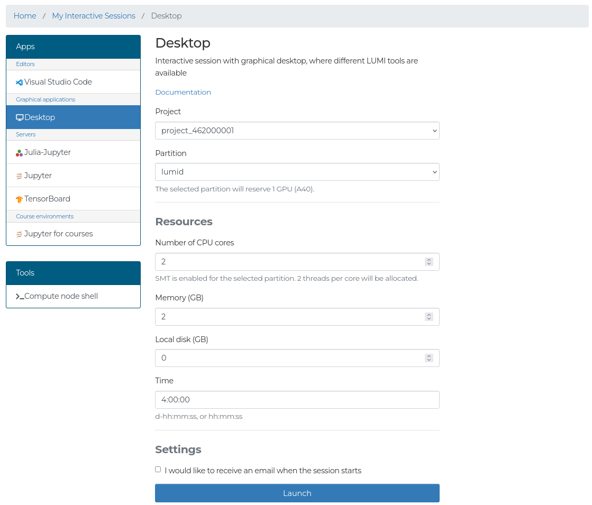
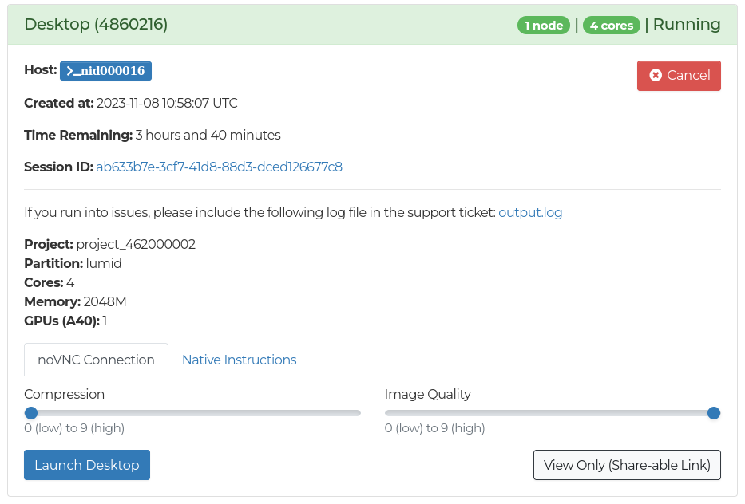
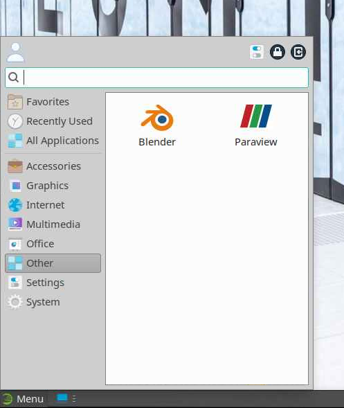

# Desktop

The Desktop app allows running various graphical applications on the LUMI compute nodes.

When launched on the LUMI-D partition, GPU acceleration is available for specific applications.
On other partitions, CPU rendering is used, which can be slow in some applications.

## Features

For both the GPU accelerated Desktop and the normal Desktop, you will find basic tools for viewing images, videos, editing text and managing files.

## Connecting

Once the job has started, there are two ways to connect to the desktop.

1. With web-browser. The noVNC Connection tab can be used to connect to the remote desktop using a web browser by selecting wanted compression and quality and then clicking Launch Desktop. Using the browser to connect is recommended for most users.
2. With VNC client. For better performance you can use a native VNC client, such as RealVNC or TigerVNC. Native VNC client may also be a good alternative if experiencing issues with clipboard integration between remote desktop and local host with the browser connection. Instructions for native VNC clients can be found in the Native instructions tab. This requires installing the VNC client on your local machine.

For the best visual quality set compression to 0 and image quality to 9 using the sliders.
For a more responsive connection increase the compression and reduce the quality. 

## GPU accelerated applications

Currently, the following graphical applications are available with GPU acceleration on LUMI-D:

- Blender
- ParaView

You can find the available applications in the apps dropdown in the taskbar, under the *Other* category.
If you want to be able to access the apps easier, shortcuts to the applications can be created by dragging the icons to the desktop.

