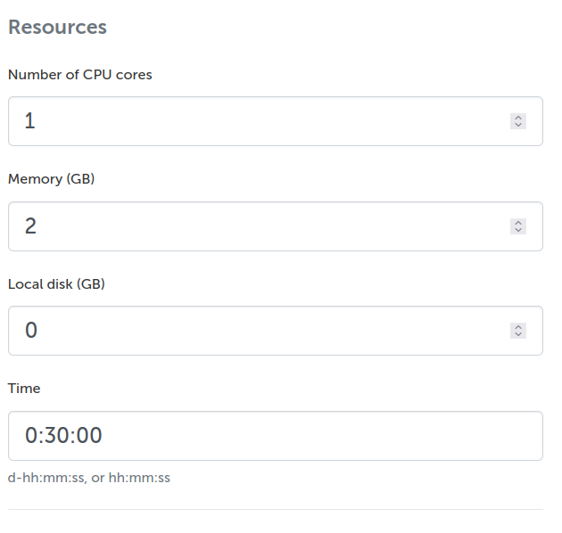
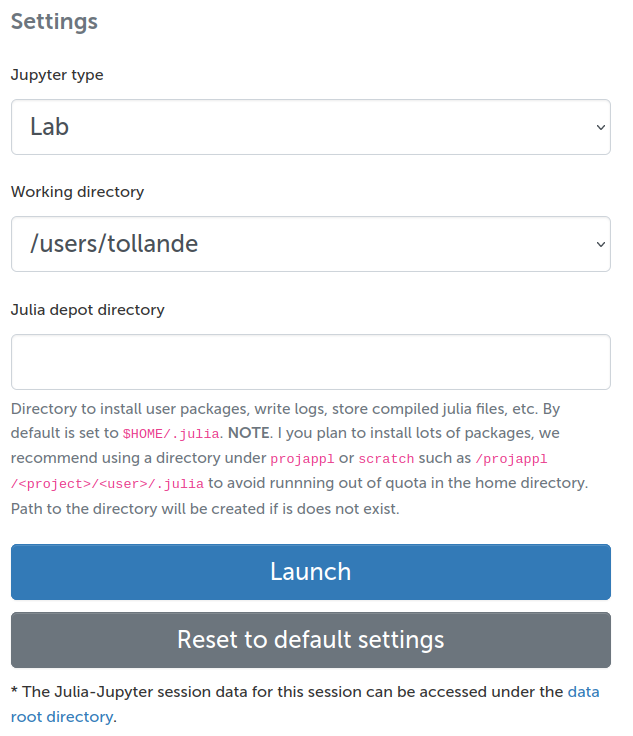
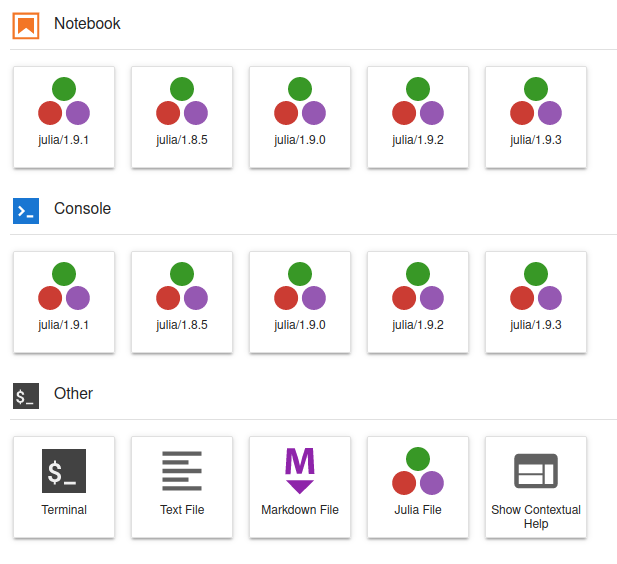

# Julia Jupyter
## Selecting the Julia-Jupyter application

We can use Julia on Jupyter through the [LUMI](https://www.lumi.csc.fi) web interfaces by selecting the **Julia-Jupyter** application from the menu.

## Launching Julia-Jupyter

Now, we need to select the resources for running Julia-Jupyter.
First, we must select a project for billing and partition for computing resources.

Next, we must set the desired computing resources: CPU cores, memory, local disk, and time.

Finally, we must select the Jupyter type. We recommend using the Jupyter lab, but the classic notebook is also available.
The working directory sets the root directory for Jupyter.
The Julia depot directory sets the location for package installations, compiled files, and other Julia depots.
If you plan to install large amounts of Julia packages, we recommend using Projappl or Scratch instead of the home directory as it could run out of quota.
For example, Plots.jl installs over 10k files and is quite large.

## Starting Julia kernel

Inside the Jupyter session, we can start notebooks with the desired Julia version.
Starting a kernel loads the corresponding Julia module and starts the notebook.
We launched the Julia kernel using the [IJulia.jl](https://github.com/JuliaLang/IJulia.jl).
We note that the Jupyter installation for Julia is separate from the Jupyter installation for Python and is not intended for other use.
