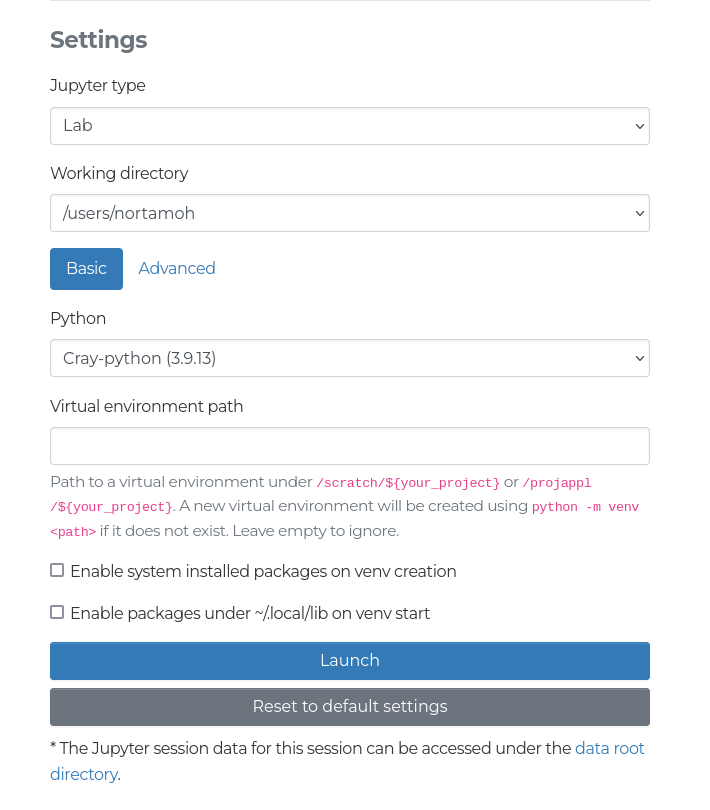

The Jupyter app launches Jupyter Lab on a LUMI compute node, which you can access from the web interface.

In the form you will be able to select.

- **Jupyter type:** The notebook type that will be launched, either Notebook or Lab.
    It is recommended to use _Lab_ as _Notebook_ is being deprecated.
    If you do want to use _Notebook_, ensure that the Python environment you are using has the `nbclassic` package installed.
- **Working directory:** The directory where your notebook file is stored.
- **Basic or Advanced:** The _Basic_ setting allows you so use a Python module provided by the system, with either a virtual environment or user-installed packages to extend the module.
    The _Advanced_ setting lets you set up the Python environment either using a script provided in the form, or a path to a script.
    For more details about these, see the sections below.

## Basic

In the basic settings, the following settings are available:

- **Python**: Two Python modules are provided: `Cray-python`, and `pytorch 2.0`, which has limited support available.
    You can also select _Custom_ to provide a full path to the Python interpreter you want to use.
- **Virtual environment path:** If the provided path does not exist, a new virtual environment using the module, or Python interpreter, selected will be created.
    If an existing path is provided, that virtual environment will be used.
    Note that virtual environments created outside of the web interface are not guaranteed to work, so creating your virtual environments in the web interface is recommended.
    If the field is left empty, no virtual environment is created or used.
- **Enable system installed packages on venv creation:** If you are basing your Python environment on an existing Python module, you should enable this setting to ensure that you are able to use the Python packages provided by the module.
    If you are creating a Python environment, and only using the modules to provide a specific Python version, you can disable this setting.
- **Enable packages under ~/.local/lib on venv start**: Enables using packages installed using `pip --user install` in virtual environments.
    It is recommended to leave this disabled to avoid conflicts in package versions.

## Advanced

In the advanced settings, you can find the following settings:

- **Custom init _Text_ / Script to start:** Enter the full script for configuring up the environment to run Jupyter lab in the text box.
- **Custon init _File_ / Path to script:** Enter the path to the script for configuring the environment to run Jupyter lab in the text box.

The script or path to script will be sourced by bash before starting Jupyter.
To ensure that Jupyter launches correctly, ensure that `python` is available on the path, and the `jupyterlab` package has been installed.
If you are using the classic notebook type, also ensure that the `nbclassic` has been installed.
Jupyter will be launched using the command `python -m jupyter $jp_type`, where `jp_type` is either `notebook` or `lab`.
